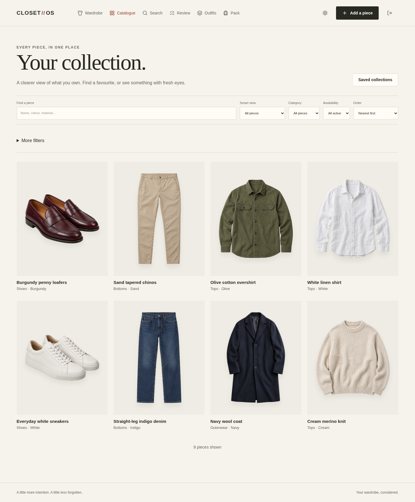
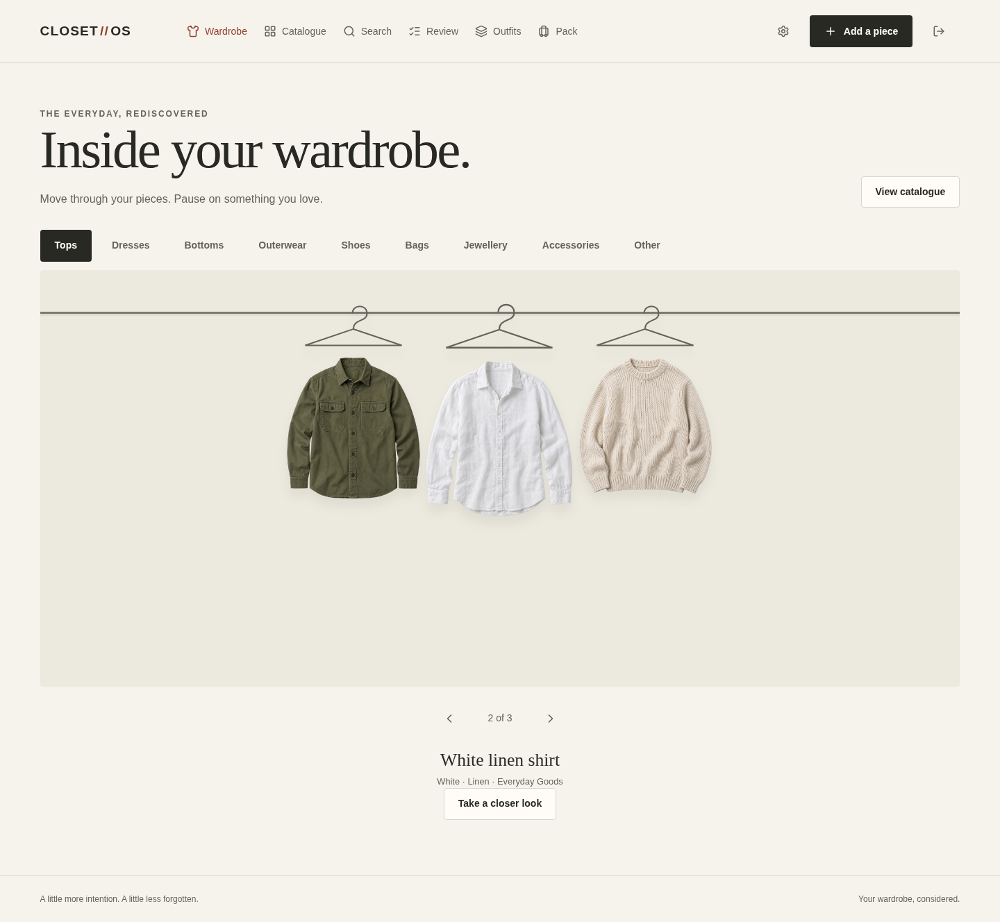
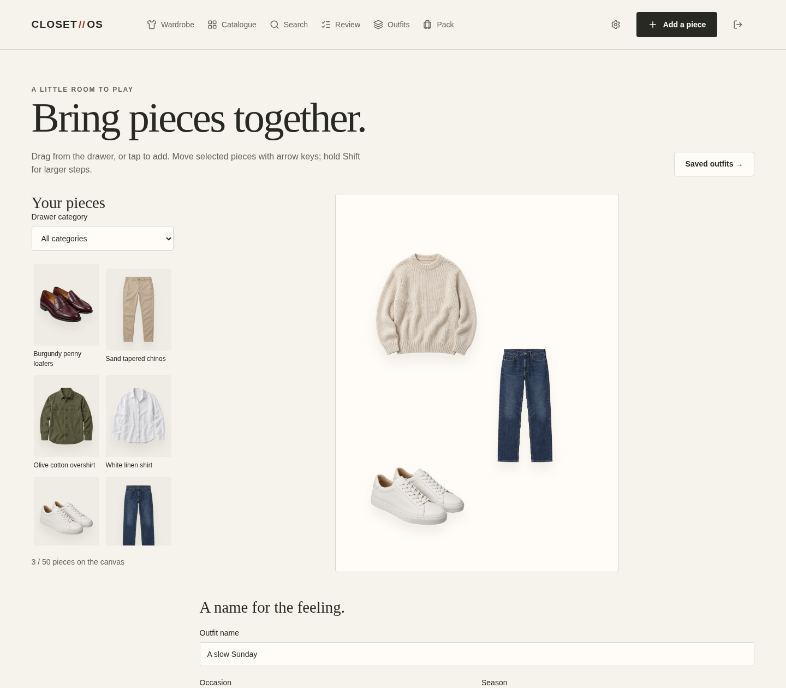
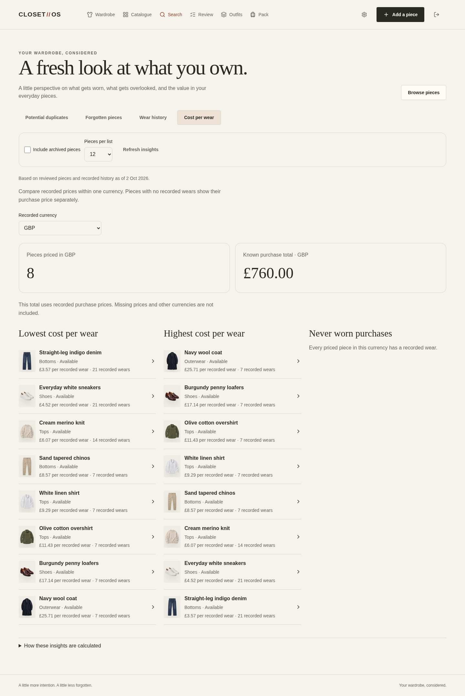
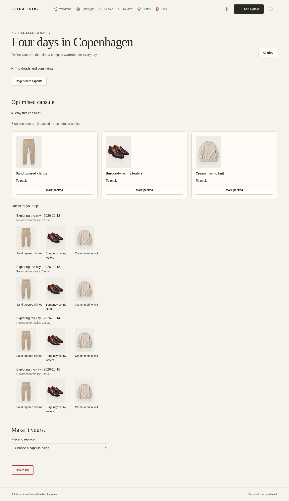
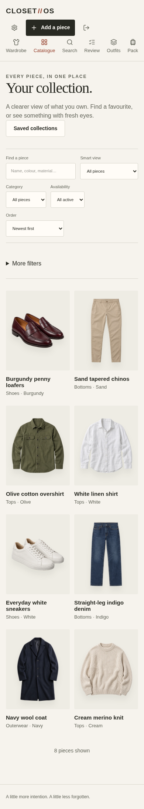

# CLOSET//OS

A wardrobe app for keeping track of your clothes, putting outfits together, and packing what you already own.



Upload a photo and the app removes the background, prepares the images, and gives you a chance to review the details. From there, you can browse a wardrobe rail, filter the catalogue, search by text or photo, and save collections.

The outfit studio uses those same clothes. Arrange a few pieces, save the layout, and record when you wear it. Wear history feeds into cost per wear and suggestions for overlooked pieces. For a trip, enter the dates, weather assumptions, occasions, and packing limits; the solver builds a capsule and a daily outfit schedule.

Everything pictured here is saved in two fictional local accounts. The garment photos went through the normal upload and processing pipeline. No mock API responses or screenshot-only UI.

<details>
<summary>A look around</summary>

The wardrobe rail.



A saved outfit in the studio.



Purchase prices and recorded wears, with the calculations visible.



A four-day trip, with a generated capsule and scheduled outfits.



The same catalogue on a phone.



</details>

## Under the hood

- **Java 25 / Spring Boot 4.1**, with Spring Modulith boundaries, PostgreSQL, Flyway, and pgvector. The [API modules](apps/api/src/main/java/com/closetos) keep wardrobe, media, search, outfits, and packing behind explicit interfaces.
- **Next.js 16 / React 19 / TypeScript**. A server-side authentication layer fronts the API; React Query handles server state. The [wardrobe graph](apps/web/features/topology) uses Three.js, with force layout computed in a Web Worker.
- A [Python media worker](workers/media-processor/src/closetos_media) runs BiRefNet background removal and local CLIP embeddings. Uploads go directly to private object storage; the API checks size and checksum. Processing and embedding jobs use durable work records, retries, and idempotency keys.
- [Packing](apps/api/src/main/java/com/closetos/packing) uses OR-Tools CP-SAT. Weather tags, occasion coverage, required and excluded garments, laundry, and rewear limits are constraints. Infeasible requests return explanations; generated plans are checked before being saved.
- [Terraform](infra) and [release workflows](.github/workflows/release.yml) support AWS: ECS, S3/CloudFront, Step Functions, Cognito, and Bedrock. Locally, Keycloak and MinIO stand in for identity and storage, and the models run on the machine.

## Run locally

Use JDK 25, Node.js 24, pnpm 10, Python 3.12 or 3.13, uv, and Docker Compose. Allow at least 12 GiB of Docker host memory for the full native verification stack. Setup downloads the segmentation and embedding models, so the first run takes longer.

```sh
make setup
make dependencies
```

Then run these in three terminals:

```sh
make api
make media-worker
make web
```

Open [localhost:3000](http://localhost:3000). Register an account, or populate the demo:

```sh
make demo
```

This creates Alex and Sam's separate wardrobes, three outfits each, 28 wear entries each, two collections each, and a trip each. Generated login details are written to the ignored `.demo-accounts.json` file with owner-only permissions. Rerunning resumes the seed using the saved accounts.

With the services running, `make demo-screenshots` refreshes the screenshots from those accounts.

## Checks and current state

Local verification passed 435 API tests, 89 frontend tests, 65 worker tests, and 58 browser journeys across desktop and mobile. The browser run used real image processing and embeddings. Terraform also passed 70 scenarios with mocked AWS providers; the release scripts passed 113 tests.

```sh
make test-api
make test-web
make test-worker
make test-e2e
make test-infra
make test-release
```

The core product runs locally. AWS support is implemented and tested offline, but has not been deployed to a live account. Complete account deletion, broader operational monitoring, and production performance work remain on the roadmap.
